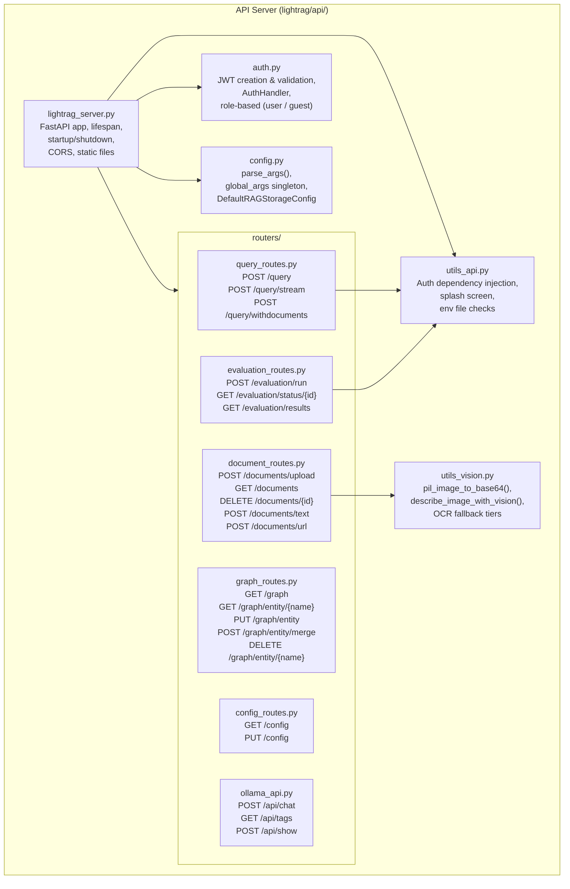
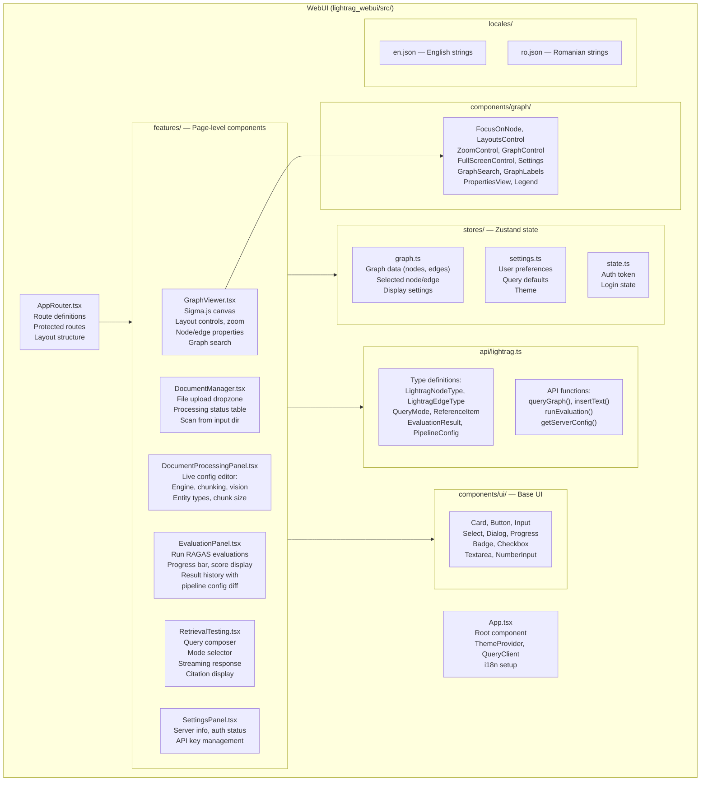
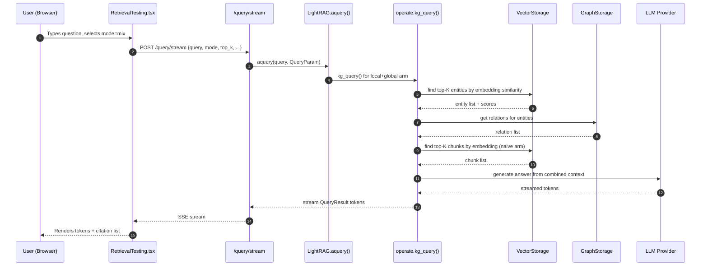

# C4 Component Diagrams

## API Server Components

```mermaid
graph TB
    subgraph api_server ["API Server (lightrag/api/)"]
        server["lightrag_server.py<br/>FastAPI app, lifespan,<br/>startup/shutdown,<br/>CORS, static files"]

        auth["auth.py<br/>JWT creation & validation,<br/>AuthHandler,<br/>role-based (user / guest)"]

        config["config.py<br/>parse_args(),<br/>global_args singleton,<br/>DefaultRAGStorageConfig"]

        utils_api["utils_api.py<br/>Auth dependency injection,<br/>splash screen,<br/>env file checks"]

        utils_vision["utils_vision.py<br/>pil_image_to_base64(),<br/>describe_image_with_vision(),<br/>OCR fallback tiers"]

        subgraph routers ["routers/"]
            query_r["query_routes.py<br/>POST /query<br/>POST /query/stream<br/>POST /query/withdocuments"]
            doc_r["document_routes.py<br/>POST /documents/upload<br/>GET /documents<br/>DELETE /documents/{id}<br/>POST /documents/text<br/>POST /documents/url"]
            graph_r["graph_routes.py<br/>GET /graph<br/>GET /graph/entity/{name}<br/>PUT /graph/entity<br/>POST /graph/entity/merge<br/>DELETE /graph/entity/{name}"]
            config_r["config_routes.py<br/>GET /config<br/>PUT /config"]
            eval_r["evaluation_routes.py<br/>POST /evaluation/run<br/>GET /evaluation/status/{id}<br/>GET /evaluation/results"]
            ollama_r["ollama_api.py<br/>POST /api/chat<br/>GET /api/tags<br/>POST /api/show"]
        end
    end

    server --> auth
    server --> config
    server --> utils_api
    server --> routers

    doc_r --> utils_vision
    query_r --> utils_api
    eval_r --> utils_api
```

## LightRAG Core Components

```mermaid
graph TB
    subgraph core ["LightRAG Core (lightrag/)"]
        lightrag["lightrag.py<br/>LightRAG dataclass<br/>ainsert() / aquery()<br/>initialize_storages() / finalize_storages()<br/>Workspace isolation"]

        operate["operate.py<br/>extract_entities()<br/>merge_nodes_and_edges()<br/>kg_query() / naive_query()<br/>rebuild_knowledge_from_chunks()"]

        chunking_mod["chunking.py<br/>ChunkingMethod enum<br/>create_semantic_chunking_func()<br/>create_hybrid_chunking_func()"]

        base["base.py<br/>Abstract base classes:<br/>BaseKVStorage, BaseVectorStorage<br/>BaseGraphStorage, DocStatusStorage<br/>QueryParam dataclass"]

        prompt["prompt.py<br/>PROMPTS dict:<br/>entity_extraction_system_prompt<br/>keywords_extraction<br/>naive/local/global/mix templates"]

        utils["utils.py<br/>EmbeddingFunc, Tokenizer<br/>Cache management<br/>compute_mdhash_id()"]

        constants["constants.py<br/>DEFAULT_ENTITY_TYPES<br/>DEFAULT_TOP_K / CHUNK_TOP_K<br/>All numeric defaults"]

        types["types.py<br/>KnowledgeGraph, KnowledgeGraphNode<br/>KnowledgeGraphEdge<br/>GPTKeywordExtractionFormat"]

        namespace["namespace.py<br/>NameSpace enum<br/>Storage namespace constants"]

        subgraph kg ["kg/ — Storage backends"]
            json_kv["json_kv_impl.py<br/>JsonKVStorage"]
            networkx["networkx_impl.py<br/>NetworkXStorage"]
            nano_vdb["nano_vector_db_impl.py<br/>NanoVectorDBStorage"]
            json_doc["json_doc_status_impl.py<br/>JsonDocStatusStorage"]
            neo4j["neo4j_impl.py<br/>Neo4JStorage"]
            pg["postgres_impl.py<br/>PGKVStorage / PGVectorStorage<br/>PGGraphStorage / PGDocStatusStorage"]
            redis_impl["redis_impl.py<br/>RedisKVStorage / RedisDocStatusStorage"]
            milvus["milvus_impl.py<br/>MilvusVectorDBStorage"]
            qdrant["qdrant_impl.py<br/>QdrantVectorDBStorage"]
            mongo["mongo_impl.py<br/>MongoKVStorage / MongoVectorDBStorage<br/>MongoGraphStorage / MongoDocStatusStorage"]
            faiss["faiss_impl.py<br/>FaissVectorDBStorage"]
            memgraph["memgraph_impl.py<br/>MemgraphStorage"]
            shared["shared_storage.py<br/>Namespace data registry<br/>Keyed lock management<br/>Default workspace"]
        end

        subgraph llm_mod ["llm/ — LLM providers"]
            openai_llm["openai.py<br/>gpt_4o_complete, openai_embed<br/>openai_complete_if_cache"]
            ollama_llm["ollama.py<br/>ollama_model_complete<br/>ollama_embed"]
            gemini_llm["gemini.py<br/>gemini_complete<br/>gemini_embed"]
            bedrock_llm["bedrock.py<br/>bedrock_complete"]
            binding_opts["binding_options.py<br/>OpenAILLMOptions<br/>OllamaLLMOptions<br/>GeminiLLMOptions"]
        end
    end

    lightrag --> operate
    lightrag --> chunking_mod
    lightrag --> base
    lightrag --> kg
    operate --> prompt
    operate --> utils
    operate --> constants
    lightrag --> llm_mod
```

## WebUI Components

```mermaid
graph TB
    subgraph webui ["WebUI (lightrag_webui/src/)"]
        app["App.tsx<br/>Root component<br/>ThemeProvider, QueryClient<br/>i18n setup"]

        router["AppRouter.tsx<br/>Route definitions<br/>Protected routes<br/>Layout structure"]

        subgraph features ["features/ — Page-level components"]
            graph_viewer["GraphViewer.tsx<br/>Sigma.js canvas<br/>Layout controls, zoom<br/>Node/edge properties<br/>Graph search"]

            doc_manager["DocumentManager.tsx<br/>File upload dropzone<br/>Processing status table<br/>Scan from input dir"]

            doc_proc["DocumentProcessingPanel.tsx<br/>Live config editor:<br/>Engine, chunking, vision<br/>Entity types, chunk size"]

            eval_panel["EvaluationPanel.tsx<br/>Run RAGAS evaluations<br/>Progress bar, score display<br/>Result history with<br/>pipeline config diff"]

            retrieval["RetrievalTesting.tsx<br/>Query composer<br/>Mode selector<br/>Streaming response<br/>Citation display"]

            settings["SettingsPanel.tsx<br/>Server info, auth status<br/>API key management"]
        end

        subgraph stores ["stores/ — Zustand state"]
            graph_store["graph.ts<br/>Graph data (nodes, edges)<br/>Selected node/edge<br/>Display settings"]
            settings_store["settings.ts<br/>User preferences<br/>Query defaults<br/>Theme"]
            state_store["state.ts<br/>Auth token<br/>Login state"]
        end

        subgraph api_client ["api/lightrag.ts"]
            api_types["Type definitions:<br/>LightragNodeType, LightragEdgeType<br/>QueryMode, ReferenceItem<br/>EvaluationResult, PipelineConfig"]
            api_calls["API functions:<br/>queryGraph(), insertText()<br/>runEvaluation()<br/>getServerConfig()"]
        end

        subgraph ui_components ["components/ui/ — Base UI"]
            ui_lib["Card, Button, Input<br/>Select, Dialog, Progress<br/>Badge, Checkbox<br/>Textarea, NumberInput"]
        end

        subgraph graph_components ["components/graph/"]
            sigma_controls["FocusOnNode, LayoutsControl<br/>ZoomControl, GraphControl<br/>FullScreenControl, Settings<br/>GraphSearch, GraphLabels<br/>PropertiesView, Legend"]
        end

        subgraph locales ["locales/"]
            en_json["en.json — English strings"]
            ro_json["ro.json — Romanian strings"]
        end
    end

    router --> features
    features --> stores
    features --> api_client
    features --> ui_components
    graph_viewer --> sigma_controls
```

## Data Flow Through Components on a Query

```mermaid
sequenceDiagram
    autonumber
    participant U as User (Browser)
    participant RT as RetrievalTesting.tsx
    participant API as /query/stream
    participant LR as LightRAG.aquery()
    participant OP as operate.kg_query()
    participant VS as VectorStorage
    participant GS as GraphStorage
    participant LLM as LLM Provider

    U->>RT: Types question, selects mode=mix
    RT->>API: POST /query/stream {query, mode, top_k, ...}
    API->>LR: aquery(query, QueryParam)
    LR->>OP: kg_query() for local+global arm
    OP->>VS: find top-K entities by embedding similarity
    VS-->>OP: entity list + scores
    OP->>GS: get relations for entities
    GS-->>OP: relation list
    OP->>VS: find top-K chunks by embedding (naive arm)
    VS-->>OP: chunk list
    OP->>LLM: generate answer from combined context
    LLM-->>OP: streamed tokens
    OP-->>API: stream QueryResult tokens
    API-->>RT: SSE stream
    RT-->>U: Renders tokens + citation list
```
