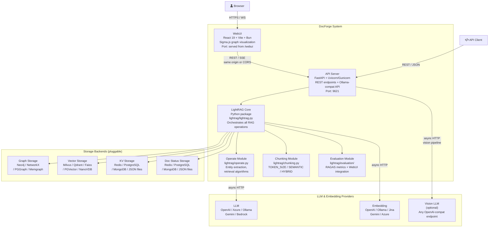

# C4 Container Diagram

This diagram expands the DocForge system boundary into its major deployable units.

## Container Descriptions

### WebUI
**Technology:** React 19, TypeScript, Vite build system, Bun package manager, Tailwind CSS, Shadcn/ui components, Sigma.js (@react-sigma) for graph rendering.

**Responsibilities:**
- Graph explorer — interactive 2D visualization with zoom, pan, node/edge selection, search, layout algorithms (Force Atlas, Circular, etc.)
- Document manager — upload, list, delete, and monitor processing status of documents
- Retrieval testing — compose queries, choose mode and parameters, view streamed responses with citations
- Evaluation panel — run RAGAS evaluations, view results with score breakdowns by metric and pipeline config
- Document processing panel — live configuration of extraction engine, chunking strategy, vision model settings
- Settings panel — server configuration, authentication status
- i18n: English and Romanian (`en.json`, `ro.json`)
- Theme: Claude-inspired warm light (`--primary: hsl(18 55% 50%)`) with dark mode support

**Build output:** Compiled into `lightrag/api/webui/` and served as static files by the API server at `/webui`.

### API Server
**Technology:** FastAPI, Uvicorn (single-worker development), Gunicorn (multi-worker production).

**Entry point:** `lightrag.api.lightrag_server:app` (CLI: `lightrag-server`, `lightrag-gunicorn`)

**Router groups:**

| Tag | Prefix | File | Purpose |
|-----|--------|------|---------|
| `query` | `/query` | `query_routes.py` | RAG queries, streaming |
| `documents` | `/documents` | `document_routes.py` | Upload, list, delete, pipeline status |
| `graph` | `/graph` | `graph_routes.py` | CRUD on entities and relations |
| `config` | `/config` | `config_routes.py` | Read/update server configuration |
| `evaluation` | `/evaluation` | `evaluation_routes.py` | RAGAS evaluation lifecycle |
| `ollama` | `/api` | `ollama_api.py` | Ollama-compatible endpoints |

**Auth middleware:** JWT (Bearer token) or API key (`X-API-Key` header). Configurable path whitelist.

### LightRAG Core
**File:** `lightrag/lightrag.py`

**The `LightRAG` dataclass** is the central orchestrator. Key responsibilities:
- Resolves and instantiates storage backends based on configuration
- Exposes `ainsert()` for document ingestion and `aquery()` for retrieval
- Manages async concurrency limits via semaphores
- Provides workspace isolation

Must always call `await rag.initialize_storages()` before use.

### Operate Module
**File:** `lightrag/operate.py`

Contains the core algorithms:
- `extract_entities()` — sends chunks to LLM with entity extraction prompt, parses structured output
- `merge_nodes_and_edges()` — merges extracted entities/relations into existing graph, triggers LLM summary when description count exceeds threshold
- `kg_query()` — implements local, global, hybrid, and mix retrieval modes using vector search + graph traversal
- `naive_query()` — pure vector similarity on chunks

### Chunking Module
**File:** `lightrag/chunking.py`

Three chunking strategies:
- `TOKEN_SIZE` — token-window sliding with configurable size and overlap (default: 1200/100)
- `SEMANTIC` — compute embeddings per sentence, find breakpoints by cosine distance percentile
- `HYBRID` — token-window with semantic boundary alignment

### Evaluation Module
**Files:** `lightrag/evaluation/eval_rag_quality.py`, `lightrag/evaluation/evaluation_manager.py`

- `RAGASEvaluator` — wraps RAGAS metrics (faithfulness, answer relevance, context recall, context precision)
- `EvaluationManager` — background task management with progress tracking for WebUI integration
- Captures pipeline configuration snapshot at evaluation start for reproducibility comparisons
- Results stored as JSON in `lightrag/evaluation/results/`

## Container Communication Summary

| From | To | Protocol | Notes |
|------|----|----------|-------|
| Browser | WebUI (Vite dev server or served static) | HTTPS | Development: Vite proxy; Production: served from `/webui` by API server |
| WebUI | API Server | REST/JSON, SSE for streaming | Same origin in production |
| API Server | LightRAG Core | In-process Python calls | Same process, no serialization overhead |
| LightRAG Core | Storage Backends | asyncpg (PG), neo4j driver (Neo4j), pymilvus, redis-py, etc. | Each uses async drivers |
| LightRAG Core | LLM / Embedding Providers | HTTPS (aiohttp / httpx) | Configurable timeout, retry via tenacity |
