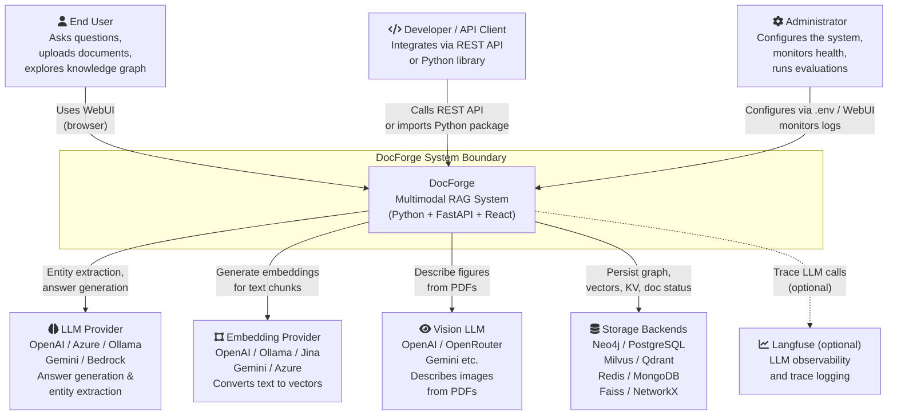

# C4 Context Diagram

The context diagram shows DocForge as a black box within its environment — who uses it and what external systems it depends on.

## Actors

### End User
Browser-based interaction through the React WebUI. Primary activities:
- Upload documents and monitor processing status
- Query the knowledge graph via the retrieval testing panel
- Explore the interactive graph visualization (Sigma.js)
- Run and review RAGAS evaluations
- Adjust pipeline configuration (chunking, vision, entity types)

### Developer / API Client
Programmatic access via:
- REST API at `http://host:9621` (full OpenAPI documentation at `/docs`)
- Ollama-compatible API (for tools built on the Ollama protocol)
- Direct Python import: `from lightrag import LightRAG`

### Administrator
Responsible for:
- Setting environment variables in `.env`
- Choosing storage backends and LLM providers
- Monitoring system health via `GET /health`
- Configuring authentication accounts and API keys

## External Systems

### LLM Provider (required)
Used for two distinct operations:
1. **Entity extraction during ingestion** — structured prompt that returns entities and relationships per chunk
2. **Answer generation during query** — generates a natural language answer from retrieved context

Configured via `LLM_BINDING`, `LLM_MODEL`, `LLM_BINDING_HOST`, `LLM_BINDING_API_KEY`. Minimum: 32B parameters, 32K context.

### Embedding Provider (required)
Converts text to dense vectors for similarity search. Used for both chunks (retrieval) and entities/relations (KG vector search).

Configured via `EMBEDDING_BINDING`, `EMBEDDING_MODEL`, `EMBEDDING_DIM`. Must remain consistent after first document ingestion — changing model requires clearing vector storage.

### Vision LLM (optional)
Only active when `VISION_ENABLED=true` and `DOCUMENT_LOADING_ENGINE=DOCLING`. Receives base64-encoded PNG images of figures/charts from PDFs and returns text descriptions that are injected into the document before chunking.

### Storage Backends (required, pluggable)
One backend must be selected for each of the four storage types. The default (development) configuration uses file-based backends that require no external services.

### Langfuse (optional)
When `LANGFUSE_ENABLE_TRACE=true`, all OpenAI-compatible LLM calls are traced. Self-hosted or cloud Langfuse instances are supported.
