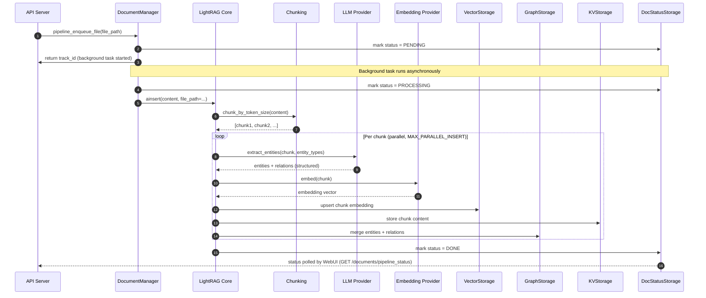
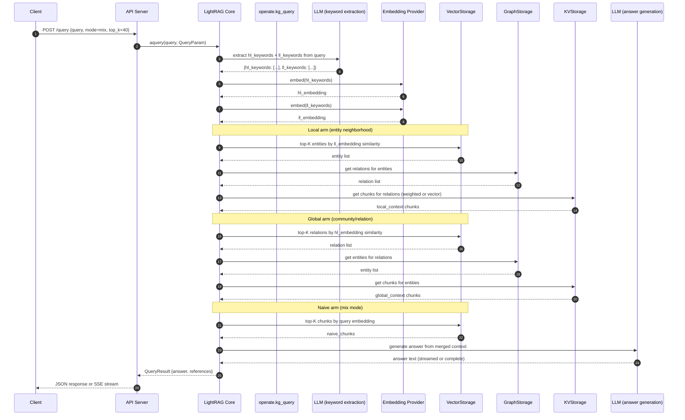
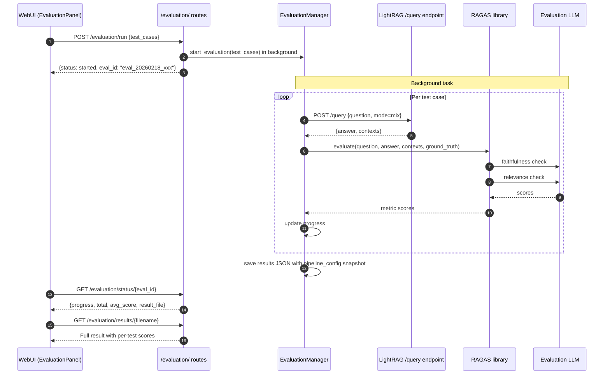

# Communication Patterns

## Synchronous Communication

### REST API (JSON over HTTPS)
All WebUI-to-API-server and external client-to-API-server communication uses JSON REST. FastAPI automatically validates request bodies against Pydantic models and returns typed JSON responses.

Key conventions:
- All endpoints are under `/` (no API version prefix) except the Ollama-compat API which uses `/api/`
- Errors follow FastAPI's `HTTPException` format: `{"detail": "message"}`
- Auth failures return `401 Unauthorized` with `WWW-Authenticate: Bearer`
- Validation errors return `422 Unprocessable Entity` with field-level detail

### Server-Sent Events (SSE) for Streaming
Query streaming is implemented with FastAPI `StreamingResponse`:

```
POST /query/stream  →  EventStream
  data: <token>
  data: <token>
  ...
  data: [DONE]
```

The WebUI (`RetrievalTesting.tsx`) reads the SSE stream and renders tokens progressively.

### Ollama-Compatible API
A separate router at `/api/` implements the Ollama wire protocol for compatibility with tools like Open WebUI, Ollama Continue, etc. This wraps the LightRAG query engine with the Ollama chat completion format.

## Asynchronous / Internal Communication

### In-Process Python Async
The API server and LightRAG core share the same process and event loop. Communication between them is direct Python async function calls — no serialization overhead, no network round-trips.

### Storage Backend Calls
All storage backends use async drivers:

| Backend | Async Driver |
|---------|-------------|
| PostgreSQL | `asyncpg` |
| Neo4j | `neo4j` async client |
| MongoDB | `motor` (via `pymongo` async) |
| Redis | `redis-py` async |
| Milvus | `pymilvus` |
| Qdrant | `qdrant-client` async |

### LLM and Embedding Provider Calls
All LLM/embedding calls use `aiohttp` or `httpx` under the hood, wrapped in `tenacity` retry logic.

Concurrency is managed by semaphores:
- `_llm_executor_lock` — limits concurrent LLM requests to `MAX_ASYNC`
- `_embedding_func_lock` — limits concurrent embedding requests to `EMBEDDING_FUNC_MAX_ASYNC`

### Keyed Lock Management
To prevent concurrent writes to the same graph entity, the system uses a keyed lock registry (`lightrag/kg/shared_storage.py`). Lock keys are generated by sorting source and target entity names to ensure consistent key generation regardless of relation direction.

```python
# Consistent lock key regardless of edge direction
sorted_key_parts = sorted([src_entity, tgt_entity])
lock_key = f"{sorted_key_parts[0]}-{sorted_key_parts[1]}"
```

## Document Ingestion Communication



## Query Communication



## RAGAS Evaluation Communication



## Integration Points Summary

| Integration | Direction | Protocol | Auth | Retry |
|-------------|-----------|----------|------|-------|
| WebUI → API | outbound | HTTPS REST / SSE | JWT or API key | Client-side, Axios |
| API client → API | outbound | HTTPS REST | JWT or API key | None (caller's responsibility) |
| LightRAG → LLM provider | outbound | HTTPS | Provider API key | `tenacity` exponential backoff |
| LightRAG → Embedding provider | outbound | HTTPS | Provider API key | `tenacity` exponential backoff |
| LightRAG → Neo4j | outbound | Bolt (TCP) | Username/password | Built-in driver retry |
| LightRAG → PostgreSQL | outbound | TCP | Username/password | `asyncpg` + custom retry (v1.4.10+) |
| LightRAG → Redis | outbound | TCP | Optional password | `redis-py` retry |
| LightRAG → Milvus | outbound | gRPC or HTTP | Optional token | `pymilvus` |
| LightRAG → Qdrant | outbound | HTTP | Optional API key | `qdrant-client` |
| LightRAG → Langfuse | outbound | HTTPS | Secret/public keys | SDK-managed |
