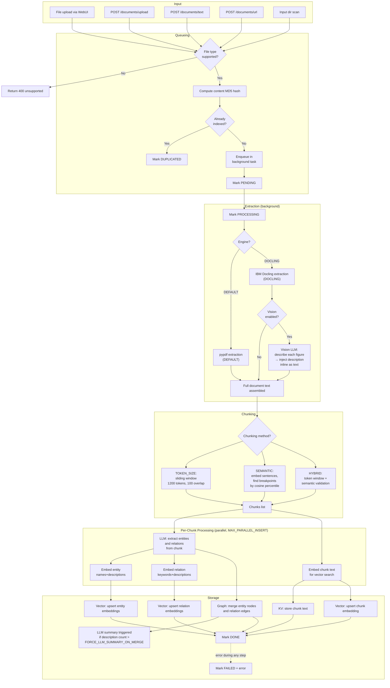
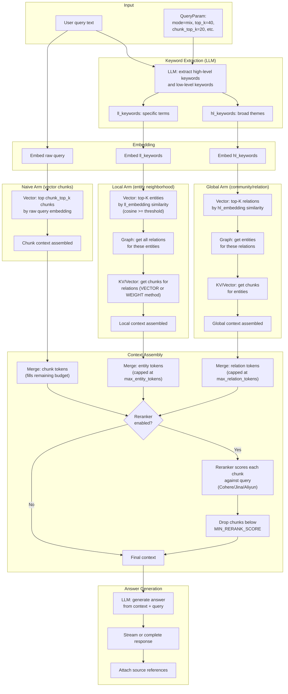
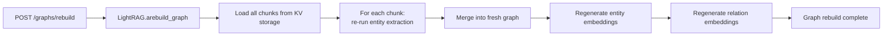
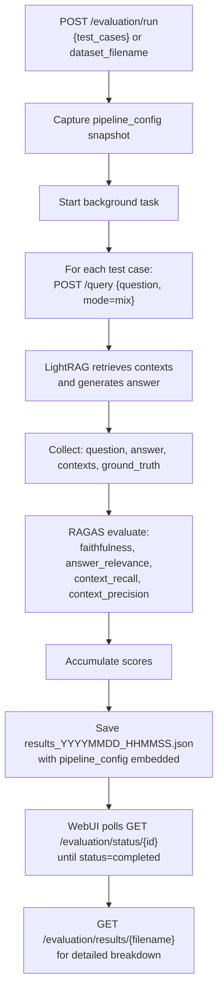
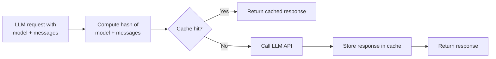

# Data Flows

## Document Ingestion Flow

This is the primary write path. Every document uploaded through the WebUI, REST API, or input directory scan goes through this flow.



## Query Flow (mix mode)

The recommended `mix` mode combines graph-traversal retrieval with pure vector retrieval, then optionally reranks the combined context.



## Retrieval Mode Comparison

| Aspect | naive | local | global | hybrid | mix |
|--------|-------|-------|--------|--------|-----|
| Primary source | Vector chunks | Entity neighborhoods | Relation summaries | local + global | KG + vector |
| Best for | Specific factual recall | Entity-centric questions | Theme/summary questions | Balanced | General purpose (recommended) |
| KG traversal | No | Yes | Yes | Yes | Yes |
| Vector search | Yes (chunks) | Yes (entities) | Yes (relations) | Yes (both) | Yes (all three) |
| Reranker benefit | High | Medium | Medium | High | Highest |
| Token consumption | Low | Medium | Medium | High | Highest |

## Graph Rebuild Flow

When documents are added but the graph becomes inconsistent (e.g., after a storage backend switch), the full graph can be rebuilt from stored chunks.



This is an expensive operation (N LLM calls where N = chunk count). Only use when necessary.

## Vision Pipeline Data Flow

When `DOCUMENT_LOADING_ENGINE=DOCLING` and `VISION_ENABLED=true`:

```mermaid
flowchart TD
    A[PDF uploaded] --> B[Docling parses PDF]
    B --> C[Docling extracts text blocks]
    B --> D["Docling detects figures/tables<br/>(up to MAX_FIGURES_PER_DOC)"]
    D --> E[Convert figure to PNG<br/>at DOCLING_IMAGES_SCALE resolution]
    E --> F[PIL image → base64 PNG]
    F --> G["Vision LLM API call:<br/>describe_image_with_vision()"]
    G --> H[Text description returned]
    H --> I["Inject description inline<br/>into document text at figure position"]
    I --> J[Normal chunking continues<br/>with enriched text]

    B --> K{Garbled text detected?<br/>(GLYPH markers)}
    K -->|Yes| L["Tier 1: force_full_page_ocr<br/>(local, free)"]
    L --> M{Still garbled?}
    M -->|Yes| N["Tier 2: Vision LLM OCR<br/>(requires VISION_ENABLED)"]
    M -->|No| J
    N --> J
    K -->|No| J
```

## Evaluation Data Flow



## LLM Cache Flow

The LLM response cache (`KV_STORE_LLM_RESPONSE_CACHE`) reduces API costs during repeated extractions of similar content.



Cache can be kept when switching embedding models (since it caches LLM responses, not embeddings). Cache is separate for extraction (`ENABLE_LLM_CACHE_FOR_EXTRACT`) and query (`ENABLE_LLM_CACHE`).
