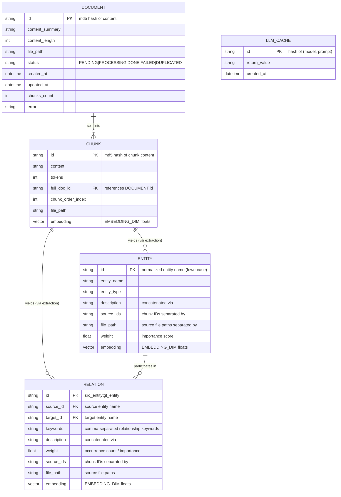
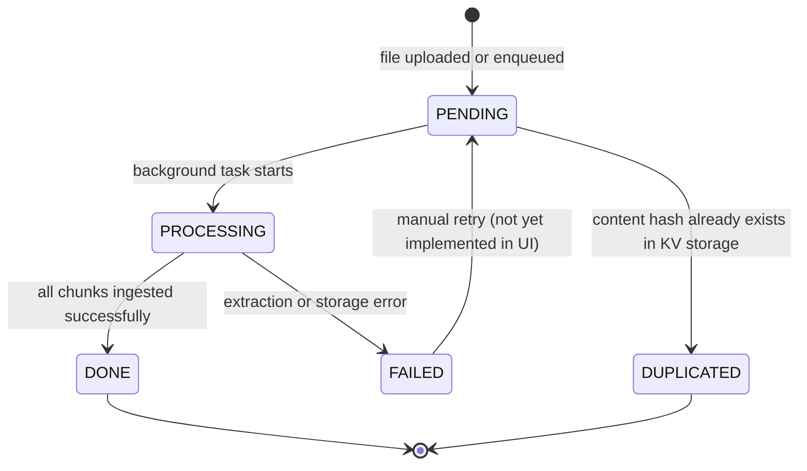

# Data Model

## Overview

DocForge uses four orthogonal storage layers. Each layer has a well-defined responsibility and can be backed by multiple implementations. The layers do not share schemas — they communicate through document and entity IDs.



## Storage Layers in Detail

### KV Storage

**Purpose:** Stores LLM response cache, raw text chunks, and document info.

**Namespaces** (defined in `lightrag/namespace.py`):

| Namespace | Content |
|-----------|---------|
| `KV_STORE_TEXT_CHUNKS` | Map of `chunk_id → TextChunkSchema` |
| `KV_STORE_FULL_DOCS` | Map of `doc_id → full document text` |
| `KV_STORE_LLM_RESPONSE_CACHE` | Map of `hash(prompt) → LLM response text` |
| `KV_STORE_COMMUNITY_REPORTS` | Map of `community_id → summary text` |

**TextChunkSchema (TypedDict):**

```python
class TextChunkSchema(TypedDict):
    tokens: int          # Token count of this chunk
    content: str         # Raw text content
    full_doc_id: str     # Parent document ID
    chunk_order_index: int  # Position within document (0-indexed)
```

**LLM Cache:** Keyed by `compute_args_hash(model, messages)`. Only successful completions are cached. Cache is per-namespace (separate for extraction vs query). Cache is disabled for streaming responses.

### Vector Storage

**Purpose:** Stores dense vector embeddings for similarity search.

**Collections** (three per instance):

| Collection | Embedded content | Used for |
|-----------|-----------------|---------|
| `chunks` | Chunk text | Naive retrieval, mix mode naive arm |
| `entities` | Entity name + description | Local mode entity similarity search |
| `relationships` | Relation keywords + description | Global mode relation similarity search |

**Embedding dimensions** must match `EMBEDDING_DIM`. Common values:
- `text-embedding-3-large` (OpenAI): 3072
- `text-embedding-3-small` (OpenAI): 1536
- `bge-m3` (Ollama): 1024

**Cosine similarity threshold:** `COSINE_THRESHOLD=0.2` (default). Embeddings scoring below this are excluded from results.

### Graph Storage

**Purpose:** Stores the entity-relation graph. Entities are nodes, relations are edges.

**Node properties:**

| Property | Type | Description |
|----------|------|-------------|
| `entity_name` | string | Human-readable entity name |
| `entity_type` | string | Taxonomy type (e.g., "ORGANIZATION") |
| `description` | string | Concatenated descriptions from all chunks mentioning this entity |
| `source_ids` | string | Chunk IDs separated by `<SEP>` |
| `file_path` | string | Source file paths separated by `<SEP>` |
| `weight` | float | Occurrence-based importance score |
| `rank` | float | Graph centrality rank |

**Edge properties:**

| Property | Type | Description |
|----------|------|-------------|
| `keywords` | string | Comma-separated relationship keywords |
| `description` | string | Concatenated descriptions from all chunks mentioning this relation |
| `weight` | float | Co-occurrence count |
| `source_ids` | string | Chunk IDs separated by `<SEP>` |
| `file_path` | string | Source file paths |

**The `<SEP>` separator** is a system constant (`GRAPH_FIELD_SEP = "<SEP>"`). It separates multiple values stored in string fields. Cannot be changed after data has been inserted.

**Entity merging:** When the same entity appears in multiple chunks, its descriptions are concatenated with `<SEP>`. When `FORCE_LLM_SUMMARY_ON_MERGE` (default 8) descriptions accumulate, an LLM summary is triggered to condense them into a single coherent description.

### Doc Status Storage

**Purpose:** Tracks the lifecycle of each document through ingestion.

**Status machine:**



**Fields:**

| Field | Type | Description |
|-------|------|-------------|
| `id` | string | MD5 hash of document content |
| `content_summary` | string | First 100 characters |
| `content_length` | int | Total character count |
| `file_path` | string | Original file path |
| `status` | enum | PENDING, PROCESSING, DONE, FAILED, DUPLICATED |
| `created_at` | datetime | When the document was first enqueued |
| `updated_at` | datetime | When status last changed |
| `chunks_count` | int | Number of chunks created |
| `error` | string | Error message if status=FAILED |

## Workspace Isolation

The `WORKSPACE` env var (or `workspace` constructor param) prefixes all storage keys/table names/collection names for data isolation. Multiple LightRAG instances can share the same physical storage backends by using distinct workspace values.

| Backend | Isolation Method |
|---------|----------------|
| JSON files | Subdirectory `{working_dir}/{workspace}/` |
| NanoVectorDB | Subdirectory `{working_dir}/{workspace}/` |
| NetworkX | Subdirectory `{working_dir}/{workspace}/` |
| PostgreSQL | `workspace` column in all tables |
| Neo4j | Node label prefix `{workspace}_` |
| Redis | Key prefix `{workspace}:` |
| Milvus | Collection name prefix |
| Qdrant | Collection name prefix |
| MongoDB | Database name prefix |

Valid workspace characters: `a-z`, `A-Z`, `0-9`, `_`.

## ID Generation

**Document IDs:** `compute_mdhash_id(content)` — MD5 hash of the full document text. Same content always gets the same ID. Enables deduplication via DUPLICATED status.

**Chunk IDs:** `compute_mdhash_id(content + str(chunk_order_index))` — ensures uniqueness even for repeated content within the same document.

**Entity IDs:** Lowercase-normalized entity name. Two entities with the same name after normalization are treated as the same entity and merged.

**Relation IDs:** `f"{src_entity}{GRAPH_FIELD_SEP}{tgt_entity}"` — undirected (always sorted alphabetically before storage).

**Lock keys:** Entity pair sorted alphabetically — `f"{min(a,b)}-{max(a,b)}"` — prevents deadlocks from concurrent edge insertions.

## Source ID Limits

To prevent unbounded growth of the `source_ids` field:

- `MAX_SOURCE_IDS_PER_ENTITY` (default 300): When exceeded, old IDs are dropped based on `SOURCE_IDS_LIMIT_METHOD`
- `MAX_SOURCE_IDS_PER_RELATION` (default 300): Same for relations

**Limit methods:**
- `FIFO` (default): First-in-first-out; oldest IDs dropped first
- `KEEP`: Keep oldest IDs; ignore new ones (less merge overhead)

## File Path Tracking

Each entity and relation stores `file_path` — a `<SEP>`-separated list of source documents. Limited to `MAX_FILE_PATHS` (default 100) paths for display. This field is metadata only and does not affect query performance.
