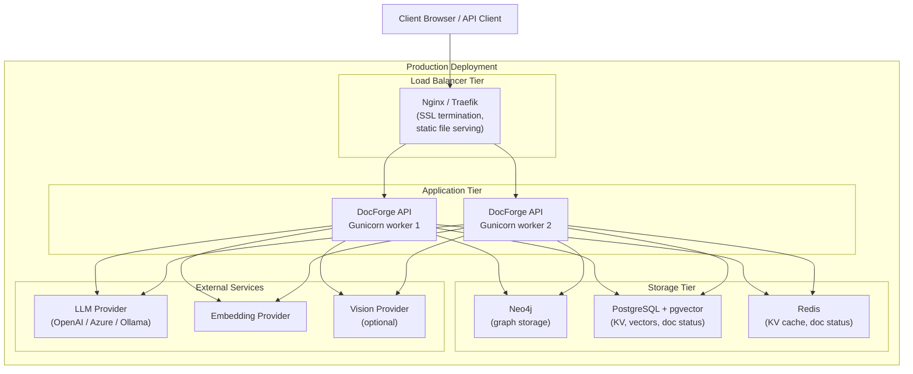

# Deployment Guide

## Deployment Architecture



## Docker Compose (Recommended for Production)

### 1. Create Data Directories

```bash
mkdir -p data/rag_storage data/inputs
```

### 2. Configure Environment

```bash
cp env.example .env
# Edit .env with production values:
# - LLM provider credentials
# - Embedding provider credentials
# - Storage backend credentials
# - AUTH_ACCOUNTS for access control
# - TOKEN_SECRET for JWT signing
```

### 3. Run with Docker Compose

```bash
docker compose up -d
```

The `docker-compose.yml` mounts:
- `./data/rag_storage` → `/app/data/rag_storage` (file-based storage)
- `./data/inputs` → `/app/data/inputs` (document input directory)
- `./config.ini` → `/app/config.ini`
- `./.env` → `/app/.env`

**Access the WebUI:** `http://your-server:9621/webui`

### 4. Update to Latest Image

```bash
docker compose pull
docker compose up -d
```

### Custom Docker Build

```bash
# Full build (includes all dependencies)
docker build -t docforge:custom .

# Lite build (minimal dependencies)
docker build -f Dockerfile.lite -t docforge:lite .
```

## Single-Process Production (Gunicorn)

For production with multiple workers, use Gunicorn instead of Uvicorn:

```bash
# Build WebUI first
./build-webui.sh   # Linux/macOS
build-webui.bat    # Windows

# Start with Gunicorn
lightrag-gunicorn
```

Gunicorn configuration is in `lightrag/api/gunicorn_config.py`. Key settings:
- `workers`: Controlled by `WORKERS` env var (default 2)
- `timeout`: Controlled by `TIMEOUT` env var (default 150s)
- Worker class: `uvicorn.workers.UvicornWorker`

**Note:** Gunicorn multi-worker mode is incompatible with Docling on macOS due to PyTorch fork-safety issues (`Docling` optional is disabled on macOS in `pyproject.toml`).

## Multi-Worker Storage Requirements

When running multiple Gunicorn workers or multiple API server instances:

**Required:** All storage backends must be external (not file-based):

| Storage Type | Multi-Worker Compatible |
|-------------|------------------------|
| `JsonKVStorage` | No (file locking issues) |
| `NanoVectorDBStorage` | No |
| `NetworkXStorage` | No |
| `JsonDocStatusStorage` | No |
| `RedisKVStorage` | Yes |
| `PGKVStorage` | Yes |
| `Neo4JStorage` | Yes |
| `MilvusVectorDBStorage` | Yes |
| `QdrantVectorDBStorage` | Yes |

Recommended multi-worker stack:
```bash
LIGHTRAG_KV_STORAGE=RedisKVStorage
LIGHTRAG_DOC_STATUS_STORAGE=RedisDocStatusStorage
LIGHTRAG_GRAPH_STORAGE=Neo4JStorage
LIGHTRAG_VECTOR_STORAGE=MilvusVectorDBStorage
```

Or all-PostgreSQL:
```bash
LIGHTRAG_KV_STORAGE=PGKVStorage
LIGHTRAG_DOC_STATUS_STORAGE=PGDocStatusStorage
LIGHTRAG_GRAPH_STORAGE=PGGraphStorage
LIGHTRAG_VECTOR_STORAGE=PGVectorStorage
```

## Systemd Service

For Linux VMs without Docker:

```bash
# Copy the example service file
cp lightrag.service.example /etc/systemd/system/docforge.service

# Edit the service file to set:
# WorkingDirectory=/path/to/docforge
# ExecStart=/path/to/docforge/.venv/bin/lightrag-server
# Environment=HOME=/path/to/home

sudo systemctl daemon-reload
sudo systemctl enable docforge
sudo systemctl start docforge
sudo systemctl status docforge
```

## Nginx Reverse Proxy

```nginx
server {
    listen 443 ssl;
    server_name docforge.example.com;

    ssl_certificate /path/to/cert.pem;
    ssl_certificate_key /path/to/key.pem;

    # Increase for large file uploads
    client_max_body_size 200M;

    location / {
        proxy_pass http://localhost:9621;
        proxy_set_header Host $host;
        proxy_set_header X-Real-IP $remote_addr;
        proxy_set_header X-Forwarded-For $proxy_add_x_forwarded_for;
        proxy_set_header X-Forwarded-Proto $scheme;

        # Required for SSE streaming queries
        proxy_buffering off;
        proxy_cache off;
        proxy_read_timeout 300s;
        proxy_connect_timeout 75s;
    }
}
```

## Kubernetes Deployment

Kubernetes manifests are provided in `k8s-deploy/`. Key considerations:

### Secrets

```yaml
# k8s-deploy/secret.yaml
apiVersion: v1
kind: Secret
metadata:
  name: docforge-secrets
type: Opaque
stringData:
  LLM_BINDING_API_KEY: "sk-your-key"
  EMBEDDING_BINDING_API_KEY: "sk-your-key"
  POSTGRES_PASSWORD: "your-password"
  TOKEN_SECRET: "your-jwt-secret"
```

### ConfigMap

```yaml
# k8s-deploy/configmap.yaml
apiVersion: v1
kind: ConfigMap
metadata:
  name: docforge-config
data:
  LLM_BINDING: "openai"
  LLM_MODEL: "gpt-4o"
  EMBEDDING_BINDING: "openai"
  EMBEDDING_MODEL: "text-embedding-3-large"
  EMBEDDING_DIM: "3072"
  LIGHTRAG_KV_STORAGE: "RedisKVStorage"
  LIGHTRAG_GRAPH_STORAGE: "Neo4JStorage"
  LIGHTRAG_VECTOR_STORAGE: "MilvusVectorDBStorage"
  LIGHTRAG_DOC_STATUS_STORAGE: "RedisDocStatusStorage"
```

### Readiness and Liveness Probes

```yaml
livenessProbe:
  httpGet:
    path: /health
    port: 9621
  initialDelaySeconds: 30
  periodSeconds: 30

readinessProbe:
  httpGet:
    path: /health
    port: 9621
  initialDelaySeconds: 15
  periodSeconds: 10
```

## SSL Configuration

### In .env (Uvicorn direct SSL)

```bash
SSL=true
SSL_CERTFILE=/path/to/cert.pem
SSL_KEYFILE=/path/to/key.pem
```

### Via Nginx (Recommended)

Terminate SSL at Nginx and proxy to HTTP localhost. See Nginx config above.

## Offline Deployment

For environments without internet access:

### Download tiktoken cache

```bash
lightrag-download-cache
# Specify cache dir in .env:
# TIKTOKEN_CACHE_DIR=/app/data/tiktoken
```

### Use Ollama for LLM and Embeddings

```bash
# Pull models on the server before deployment
ollama pull qwen2.5:32b
ollama pull bge-m3:latest

# Configure in .env
LLM_BINDING=ollama
LLM_MODEL=qwen2.5:32b
OLLAMA_LLM_NUM_CTX=32768
LLM_BINDING_HOST=http://localhost:11434

EMBEDDING_BINDING=ollama
EMBEDDING_MODEL=bge-m3:latest
EMBEDDING_DIM=1024
EMBEDDING_BINDING_HOST=http://localhost:11434
```

### Install all offline extras

```bash
uv sync --extra offline
```

## Data Migration

### Between Storage Backends

When migrating from file-based to production backends:

1. Stop the server
2. Export graph: `GET /graph` response (or use neo4j-admin export for Neo4j)
3. Configure new backend in `.env`
4. Restart server with `LIGHTRAG_GRAPH_STORAGE=Neo4JStorage`
5. Re-ingest all documents (this rebuilds the graph and vectors)

Note: Direct storage migration tools are not built in. Re-ingestion is the supported migration path.

### Workspace Migration

```bash
# Add to .env to isolate new data
WORKSPACE=production_v2

# Old data (without workspace) remains accessible via WORKSPACE=
# New data goes into production_v2 prefix
```

## Performance Tuning

### For High Document Volume

```bash
# Increase parallelism (scale with your LLM rate limits)
MAX_ASYNC=8
MAX_PARALLEL_INSERT=4
EMBEDDING_FUNC_MAX_ASYNC=16
EMBEDDING_BATCH_NUM=20
```

### For Low Latency Queries

```bash
# Reduce context size for faster LLM responses
MAX_TOTAL_TOKENS=15000
MAX_ENTITY_TOKENS=3000
MAX_RELATION_TOKENS=4000
TOP_K=20
CHUNK_TOP_K=10
```

### For High Quality Answers

```bash
# Maximize context, enable reranking
MAX_TOTAL_TOKENS=60000
TOP_K=60
CHUNK_TOP_K=30
RERANK_BINDING=cohere
RERANK_BY_DEFAULT=true
```

## Environment-Specific Configurations

### Development

```bash
HOST=127.0.0.1
PORT=9621
LOG_LEVEL=DEBUG
VERBOSE=true
# File-based storage (no external services needed)
LIGHTRAG_KV_STORAGE=JsonKVStorage
LIGHTRAG_GRAPH_STORAGE=NetworkXStorage
LIGHTRAG_VECTOR_STORAGE=NanoVectorDBStorage
LIGHTRAG_DOC_STATUS_STORAGE=JsonDocStatusStorage
```

### Production

```bash
HOST=0.0.0.0
PORT=9621
LOG_LEVEL=INFO
AUTH_ACCOUNTS=admin:strongpassword
TOKEN_SECRET=very-long-random-string-here
LIGHTRAG_KV_STORAGE=PGKVStorage
LIGHTRAG_DOC_STATUS_STORAGE=PGDocStatusStorage
LIGHTRAG_GRAPH_STORAGE=Neo4JStorage
LIGHTRAG_VECTOR_STORAGE=MilvusVectorDBStorage
WORKERS=4
```
